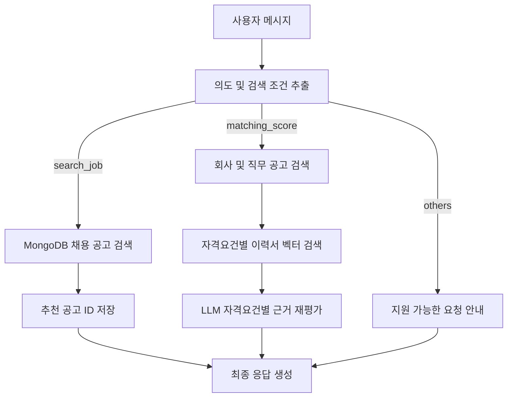

# AI Job Matcher

사용자의 자연어 요청을 분석해 채용 공고를 검색하고, 이력서 근거를 바탕으로 특정 공고의 지원 적합도를 평가하는 AI 채용 지원 서비스입니다.

4일 동안 진행한 미니 프로젝트로, 처음으로 LangGraph를 활용해 만든 멀티스텝 AI 에이전트 워크플로입니다.

## 주요 기능

### 1. 자연어 기반 채용 공고 검색

사용자가 입력한 문장에서 직무, 기술 키워드, 지역, 고용 형태를 추출한 뒤 MongoDB의 채용 공고를 검색합니다.

```text
사용자: 서울 Python 백엔드 공고 찾아줘

추출 결과:
- intent: search_job
- keyword: Python 백엔드
- job_title: 백엔드 개발자
- location: 서울
```

검색된 공고 ID는 사용자의 `recommanded_postings`에 중복 없이 저장되며, 이후 추천 공고 목록에서 다시 조회할 수 있습니다.

### 2. 이력서 저장 및 벡터 검색

사용자가 등록한 이력서 원문은 MongoDB에 저장합니다. 원문을 여러 청크로 분할하고 임베딩한 결과는 Pinecone에 저장합니다.

- MongoDB: 문서 원문과 벡터 저장 상태 관리
- Pinecone: 문서 청크 및 임베딩 저장
- Namespace: `user-{user_uuid}`
- Vector ID: `{document_id}:v{version}:chunk:{chunk_index}`

사용자별 namespace를 사용하므로 한 사용자가 등록한 여러 이력서를 한 번에 검색하면서 다른 사용자의 문서와 분리할 수 있습니다.

### 3. 채용 공고 지원 적합도 분석

사용자가 특정 회사와 직무에 지원할 만한지 질문하면 다음 순서로 분석합니다.

1. MongoDB에서 회사명과 직무명으로 채용 공고 검색
2. 공고의 `qualifications`를 각각 별도의 검색 쿼리로 사용
3. 각 자격요건을 임베딩해 사용자의 전체 이력서에서 관련 근거 검색
4. 검색된 이력서 원문을 LLM이 다시 검토
5. 자격요건별 충족 여부, 강점, 보완점 및 종합 점수 생성

자격요건별 판정 상태는 다음 세 가지입니다.

- `satisfied`: 직접적인 충족 근거가 있음
- `partially_satisfied`: 관련 경험은 있지만 일부 내용이 불명확함
- `insufficient_evidence`: 이력서에서 확인할 근거가 부족함

벡터 유사도 점수는 후보 근거를 찾는 용도로만 사용하며, 최종 충족 여부는 LLM이 이력서 원문을 확인해 판단합니다.

## 워크플로



현재는 하나의 LangGraph 상태를 여러 전문 노드가 순서대로 처리하는 구조입니다.

- `route_intent_node`: 의도와 검색 조건을 한 번에 추출
- `job_search_node`: 키워드 기반 채용 공고 검색
- `matching_score_node`: 공고 자격요건과 이력서 근거 비교
- `final_node`: 검색 및 적합도 분석 결과를 사용자 응답으로 변환

## 기술 스택

| 구분 | 기술 |
| --- | --- |
| Backend | Python 3.12, FastAPI, Uvicorn |
| AI Workflow | LangGraph, LangChain |
| LLM | OpenAI-compatible Chat API |
| Embedding | OpenAI-compatible Embedding API |
| Database | MongoDB |
| Vector Database | Pinecone |
| Validation | Pydantic |

## 프로젝트 구조

```text
.
├── app.py                         # FastAPI 앱과 API 엔드포인트
├── graph.py                       # LangGraph 노드 및 조건부 엣지 구성
├── nodes.py                       # 의도 분류, 공고 검색, 적합도 분석 노드
├── state.py                       # 그래프 상태와 LLM 구조화 출력 모델
├── schema.py                      # API 요청/응답 Pydantic 모델
├── database.py                    # MongoDB 연결 생명주기 관리
├── config.py                      # 환경변수 로드
├── llm.py                         # Chat LLM 생성
├── service
│   ├── profile.py                # 프로필 및 기술 스택 관리
│   ├── job_service.py            # 공고 검색 및 추천 공고 관리
│   ├── document_service.py       # 이력서 원문 및 벡터 인덱싱 흐름
│   ├── embedding_service.py      # 청킹 및 임베딩 생성
│   └── vector_store.py           # Pinecone 저장 및 검색
├── .env.example
└── requirments.txt
```

## 실행 방법

### 1. 저장소 준비

```bash
git clone <repository-url>
cd mini-pjt
```

### 2. 가상환경 및 패키지 설치

```bash
uv venv --python 3.12
source .venv/bin/activate
uv pip install -r requirments.txt
```

### 3. 환경변수 설정

`.env.example`을 복사해 `.env` 파일을 만들고 값을 입력합니다.

```bash
cp .env.example .env
```

```dotenv
# 채팅 LLM
OPENAI_API_KEY=
OPENAI_BASE_URL=

# MongoDB
MONGODB_URI=mongodb://localhost:27017
MONGODB_DB_NAME=job_matcher

# Pinecone
PINECONE_API_KEY=
PINECONE_INDEX_NAME=
PINECONE_INDEX_HOST=

# Embedding
EMBEDDING_API_KEY=
EMBEDDING_BASE_URL=https://api.openai.com/v1
EMBEDDING_MODEL=text-embedding-3-large
```

`OPENAI_API_KEY`와 `EMBEDDING_API_KEY`는 같은 공급자의 API를 사용한다면 같은 키를 넣어도 됩니다. 서로 다른 공급자나 프로젝트를 사용한다면 각각 알맞은 키와 Base URL을 설정해야 합니다.

Pinecone 인덱스의 dimension은 선택한 임베딩 모델의 출력 차원과 일치해야 합니다. 인덱스 이름은 `PINECONE_INDEX_NAME`에 입력하며, index host를 알고 있다면 `PINECONE_INDEX_HOST`도 설정할 수 있습니다.

### 4. MongoDB 데이터 준비

채용 공고는 `job_postings` 컬렉션에 저장합니다.

```json
{
  "company_name": "테크웨이브",
  "job_title": "백엔드 개발자",
  "job_title_normalized": "백엔드개발자",
  "tech_stack": ["Python", "FastAPI", "MongoDB"],
  "qualifications": [
    "Python 기반 애플리케이션 개발 경험",
    "LLM API를 활용한 프로젝트 경험",
    "비동기 처리에 대한 이해"
  ],
  "preferred_qualifications": ["LangGraph 사용 경험"],
  "location": "서울",
  "experience": "신입 또는 경력",
  "job_type": "정규직",
  "posting_url": "https://example.com/jobs/1"
}
```

### 5. 서버 실행

```bash
uvicorn app:app --reload
```

- API 문서: `http://127.0.0.1:8000/docs`
- 상태 확인: `http://127.0.0.1:8000/health`

## API

### 사용자 생성 또는 로그인

```http
POST /login
Content-Type: application/json

{
  "user_id": "bkk"
}
```

같은 `user_id`로 다시 요청하면 기존 사용자의 UUID를 반환합니다.

### 프로필 조회

```http
GET /profile/{user_uuid}
```

### 프로필 기술 추가

```http
POST /profile/add_skills
Content-Type: application/json

{
  "user_uuid": "ade095d1-1b9f-4e96-80d8-2f05440a7c10",
  "skill": "FastAPI"
}
```

MongoDB의 `$addToSet`을 사용하므로 동일한 기술은 중복 저장되지 않습니다.

### 이력서 등록

```http
POST /profile/documents
Content-Type: application/json

{
  "user_uuid": "ade095d1-1b9f-4e96-80d8-2f05440a7c10",
  "title": "백엔드 개발자 이력서",
  "content": "Python과 FastAPI를 사용해 비동기 API 서버를 개발했습니다."
}
```

요청 시 원문 저장, 청킹, 임베딩 생성, Pinecone 저장이 순서대로 실행됩니다.

### 여러 요구사항으로 이력서 검색

```http
POST /profile/documents/search
Content-Type: application/json

{
  "user_uuid": "ade095d1-1b9f-4e96-80d8-2f05440a7c10",
  "queries": [
    "Python 기반 애플리케이션 개발 경험",
    "LLM API를 활용한 프로젝트 경험",
    "비동기 처리에 대한 이해"
  ],
  "top_k": 5,
  "min_score": 0.7,
  "document_type": "resume"
}
```

### AI 채팅

```http
POST /chat
Content-Type: application/json

{
  "user_uuid": "ade095d1-1b9f-4e96-80d8-2f05440a7c10",
  "message": "서울 Python 백엔드 공고 찾아줘"
}
```

적합도 분석 요청 예시:

```json
{
  "user_uuid": "ade095d1-1b9f-4e96-80d8-2f05440a7c10",
  "message": "테크웨이브 백엔드 개발자 공고에 지원할 만할까?"
}
```

### 추천 공고 조회

```http
GET /postings/{user_uuid}
```

## 설계 포인트

### 의도 분류와 조건 추출 통합

별도의 LLM 호출로 검색 조건을 다시 추출하지 않고, 최초 라우팅 단계에서 `intent`, `company_name`, `job_title`, `keyword`, `location`, `job_type`을 구조화된 출력으로 함께 생성합니다. 이를 통해 워크플로를 단순화하고 LLM 호출 횟수를 줄였습니다.

### 사용자별 벡터 데이터 분리

Pinecone namespace를 사용자 UUID 기준으로 구성했습니다. 검색할 때 namespace만 지정하면 해당 사용자가 등록한 모든 이력서 청크를 대상으로 검색할 수 있습니다.

### 벡터 검색과 최종 판단 분리

유사도 점수만으로 자격요건 충족 여부를 확정하지 않습니다. 벡터 검색으로 관련 근거 후보를 넓게 가져오고, LLM이 실제 문장을 재검토해 최종 상태를 결정하도록 구성했습니다.

### 구조화된 LLM 출력

Pydantic 모델을 사용해 의도 분류와 적합도 분석 결과의 형태를 제한합니다. 문자열 파싱보다 안정적으로 다음 노드에 데이터를 전달할 수 있습니다.

## 현재 한계

- 회사명 검색 결과가 여러 개인 경우 가장 우선순위가 높은 공고 한 건을 분석합니다.
- 채용 공고 검색은 현재 직무 키워드 중심이며 복합 조건과 동의어 처리가 제한적입니다.
- 이력서 등록 과정이 동기적으로 실행되어 큰 문서에서는 응답 시간이 길어질 수 있습니다.
- 벡터 유사도 임계값은 실제 데이터 기반 튜닝이 더 필요합니다.
- 인증과 권한 검증은 데모 범위에서 제외했습니다.
- 이력서 수정 및 삭제 시 기존 Pinecone 벡터를 갱신하는 기능은 아직 없습니다.
- 그래프 실행 상태를 실시간으로 전달하는 SSE 스트리밍은 아직 적용하지 않았습니다.

## 개선 계획

- 공고 검색 조건과 동의어 처리 개선
- 여러 공고를 선택하거나 비교하는 흐름 추가
- 이력서 인덱싱을 백그라운드 작업으로 분리
- 이력서 수정·삭제 및 벡터 버전 관리
- 적합도 평가용 테스트 데이터셋과 평가 지표 구축
- LangGraph 노드 진행 상태 SSE 스트리밍
- 인증 및 사용자별 리소스 접근 제어
- 테스트 코드와 예외 처리 보강

## 프로젝트에서 배운 점

- LangGraph의 상태와 조건부 엣지를 이용해 LLM 호출과 일반 애플리케이션 로직을 하나의 흐름으로 구성하는 방법
- Pydantic 구조화 출력을 이용해 노드 사이의 데이터 계약을 명확하게 만드는 방법
- MongoDB 원문 저장소와 Pinecone 벡터 저장소의 역할을 분리하는 방법
- 벡터 유사도만으로 결론을 내리지 않고 검색과 판단 단계를 분리하는 RAG 설계
- FastAPI lifespan을 이용해 MongoDB 연결 풀의 시작과 종료를 관리하는 방법
